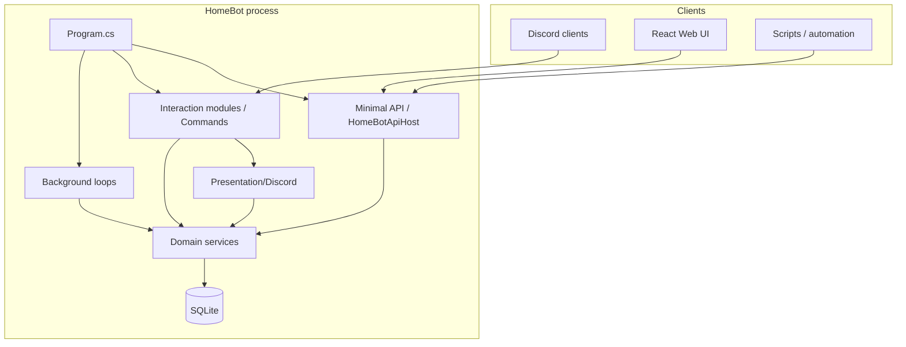

# HomeBot — backend architecture

This document explains **how the server implements** the features described in **[FEATURES.md](./FEATURES.md)**. For user-facing capabilities, start there; for install and env vars, see **[SETUP.md](SETUP.md)**.

---

## Overview

HomeBot is a single **.NET** process that can host:

1. A **Discord bot** (Discord.Net — slash commands, buttons, embeds)
2. An **ASP.NET Core minimal API** (Kestrel on port 5050 by default)

Both share one **dependency-injection container** and one **SQLite** file (`homebot.db` unless `HOMEBOT_DATABASE_PATH` is set).



**Design principle:** Domain logic lives in **`Services/`** and does not reference Discord types. Discord-specific formatting and button `customId` strings live in **`Presentation/Discord/`** and **`Commands/`**. The HTTP layer is thin validation + mapping in **`Api/`**.

---

## Startup and dependency injection

**Entry:** `Program.cs`

| Step | What happens |
|------|----------------|
| `ConfigureServices()` | Builds `IServiceProvider` via `AddHomeBotDataServices()` + `ReminderService` |
| Discord enabled | Creates `DiscordSocketClient`, `InteractionService`, assigns socket to `DiscordSocketHolder` |
| `StartApiAsync()` | If `HOMEBOT_API_ENABLED=true`, builds `WebApplication`, calls `HomeBotApiHost.Configure`, runs Kestrel |
| `OnReady` (Discord) | Registers slash modules to guild, starts `ReminderService` and `BudgetNotificationService` loops |

**Registration hub:** `Composition/HomeBotDataServices.cs` — all singleton domain and infra services:

| Service | Role |
|---------|------|
| `DatabaseService` | Connection string, `CREATE TABLE IF NOT EXISTS`, runs migrations |
| `ConfigService` | Key/value `Settings` table (`page_size`, `timezone`, tag catalogs, …) |
| `ChannelBindingService` | `ChannelBindings` — feature → Discord channel id |
| `UndoService` | `ActionLog` append + restore |
| `BuyService`, `WishlistService`, `MoneyService`, `CalendarService`, `BudgetService` | Feature domains |
| `BudgetNotificationService` | Background digest/alerts |
| `WebAuthService`, `WebRefreshTokenService`, `WebAuthDiscordVerificationService`, `DiscordOAuthService` | Web login |
| `DiscordSocketHolder`, `DiscordGuildDirectoryService`, `IDiscordChannelNotifier` | Live guild + outbound posts |
| `DiscordAuthAuditNotifier` | Sign-in lines to `audit` channel |
| `LoggingService` | Exception logging from interaction handler |

Integration tests construct the same service list and pass a temp DB path into `DatabaseService(string)`.

---

## Database

### Connection

- **Default file:** `Data Source=homebot.db` in the working directory
- **Override:** `HOMEBOT_DATABASE_PATH` — file path or full `Data Source=…` connection string
- **Tests:** explicit path per fixture to avoid parallel-test clashes

### Base schema (`DatabaseService.Initialize`)

Created on first open (idempotent `CREATE TABLE IF NOT EXISTS`):

| Table | Purpose |
|-------|---------|
| `BuyItems` | Shopping list rows |
| `WishlistItems` | Wishlist rows |
| `Transactions` | Money ledger (split expenses + payments) |
| `CalendarItems` | Events and tasks |
| `CalendarRecurrenceExceptions` | Per-occurrence omit / complete / overrides |
| `Settings` | Household config key/value |
| `ChannelBindings` | Feature → channel id |
| `ActionLog` | Undo stack (per `UserId`) |
| `WebUsers` | Web login accounts |
| `WebAuthVerifications` | Discord-verify signup sessions |
| `WebOAuthExchangeCodes` | Short-lived OAuth handoff to SPA |
| `WebRefreshTokens` | Hashed refresh tokens for browser sessions |

### Versioned migrations

After base tables, **`SchemaMigrationRunner`** applies ordered migrations from **`Services/DatabaseSchemaMigrations.cs`**, recording applied ids in **`SchemaMigrations`**.

| Migration id | Adds |
|--------------|------|
| `001_calendar_recurrence_exception_columns` | Extra columns on recurrence exceptions (kinds, overrides, instance completed) |
| `002_budget_core` | Full budget schema (categories, accounts, transactions, splits, tags, envelopes, goals, bills, recurring, audit, exchange rates, notification log) + default “Household” account |
| `003_budget_accounts_is_active` | `BudgetAccounts.IsActive` for archive |

**Rules:** migrations are **additive only**; never rename applied ids; never delete `homebot.db` in application code.

---

## HTTP API layer

### Pipeline (`Api/HomeBotApiHost.cs`)

Order matters:

1. Exception handling + HTTP logging (`HomeBotApiPhase3`)
2. CORS (`HOMEBOT_ALLOWED_ORIGINS` + optional OAuth SPA origin merge)
3. HSTS / HTTPS redirect (non-Development)
4. Rate limiter (global + per-policy)
5. Max body size guard
6. **Bearer middleware** — all `/api/*` except health, meta, openapi, and listed **public auth** routes
7. Route maps: health/meta → OAuth → auth → feature API

**Auth acceptance:** `HOMEBOT_API_TOKEN` (exact match) **or** valid HS256 JWT from `HomeBotJwtTokens` (`HOMEBOT_WEB_JWT_SECRET`, ≥ 32 UTF-8 bytes). If neither is configured, protected routes return **503**.

### Route registration

| Module | File | Prefix |
|--------|------|--------|
| Buy, wishlist, money, calendar, undo, guild members | `Api/HomeBotApiRegistration.cs` | `/api/…` reads; `/api` mutation group with rate limit |
| Budget | `Api/BudgetApiRegistration.cs` | `/api/budget/…` |
| Web auth | `Api/HomeBotAuthApi.cs` | `/api/auth/…` |
| Discord OAuth | `Api/HomeBotDiscordOAuthApi.cs` | `/api/auth/discord/oauth/…` |

**Mutations** that represent a household member’s action require query **`actorUserId`** (non-zero Discord snowflake). Validated by `TryActor` helpers; budget routes use `HomeBotApiRegistrationTryActor`.

**DTOs:** `Models/ApiRequests.cs` (request bodies), `Models/*ListItemModel.cs` and related (responses). Validation often delegates to `Utils/Validation.cs` and `Utils/ValidationHelper.cs`.

**Errors:** `Api/ApiResults.cs` → consistent JSON `{ message, code }`.

### Phase 3 cross-cutting (`Api/HomeBotApiPhase3.cs`)

- Fixed-window **rate limits** per client IP (mutations, login, refresh/logout, OAuth, account writes, Discord status poll) — tunable via `HOMEBOT_API_*_PER_MINUTE` env vars
- **Max JSON body** (`HOMEBOT_API_MAX_BODY_BYTES`, default 64 KiB)
- **OpenAPI** document at `GET /openapi/v1.json`
- Production exception handler (no stack traces to clients)

### API → Discord side effects

After successful **POST** creates (and some budget mutations), handlers call:

- **`IDiscordChannelNotifier.NotifyFeatureChannelAsync(feature, message)`** — `DiscordChannelNotifier` resolves `ChannelBindings` and posts to the bound channel if the socket is connected
- **Budget-specific:** `Api/BudgetApiDiscordNotify.cs` formats transaction/transfer lines
- **Bill → calendar:** `Api/BudgetBillCalendarHelper.cs` creates a monthly calendar event via `CalendarService.AddItem`

Features **`buy`**, **`wishlist`**, **`money`**, **`calendar`**, **`budget`** each have binding keys; **`audit`** is used only for web sign-in audit posts.

---

## Discord layer

### Slash commands

**Modules** in `Commands/` (one class per area). Registered on guild ready via `InteractionService.RegisterCommandsToGuildAsync`.

**Channel guard:** `Program.HandleInteraction` loads `CommandFeatureMap.GetFeature(commandName)`. If mapped to a feature, `ChannelGuard.IsCorrectChannel` compares the interaction channel to `ChannelBindingService.GetChannel(feature)`. Unbound features allow any channel.

**Unrestricted commands** (`CommandFeatureMap` returns null): `setup-set`, `setup-view`, `config-*`, `timezone-*`, `undo`, `webui-verify`, `help`, `dashboard`.

### Buttons and list UIs

`Program` handles `SocketMessageComponent` **before** slash routing (timeout avoidance). Custom ids encode action + entity ids (e.g. buy complete, calendar pagination, `calrst-{today|upcoming}-{page}-{id}-{unix}` for instance reset).

**List embeds** for buy, wishlist, money, calendar today/upcoming are built in **`Presentation/Discord/*Presentation.cs`**, calling the same service methods the API uses, then attaching `ListUIBuilder` components.

### Detail commands

Some flows (e.g. `wishlist-view`, `calendar-view`) still build one-off embeds inside command modules — acceptable Discord-only presentation.

---

## Domain services (by feature)

### Buy — `BuyService`

- CRUD on `BuyItems`; status `active` / completed
- Tags stored as CSV on row; optional catalog in `Settings` (`buy_tags`) enforced on write when non-empty
- **Undo:** `complete` and `delete` log to `ActionLog` with serialized row on delete
- List pagination uses `ConfigService` `page_size`

### Wishlist — `WishlistService`

- Same patterns as buy: owners (Discord id), tags catalog, pagination, undo on delete/complete

### Money — `MoneyService`

- `Transactions` with `Type` distinguishing split expenses vs payments
- Amount parsing via `Utils/MathParser.cs`
- Balances computed from ledger (not stored denormalized)
- **Undo** on delete with `MoneyUndoModel` JSON snapshot
- List returns `MoneyTransactionListItemModel` including `description` / `notes`

### Calendar — `CalendarService`

Largest service (~1.6k lines). Responsibilities:

| Area | Implementation notes |
|------|----------------------|
| **Storage** | `CalendarItems` row per series or one-off; `Timezone` column; `Recurrence` daily/weekly/monthly |
| **Range expansion** | `GetRange(from, to, userFilter, windowTimeZoneId)` — max **92 days** (`RangeMaxDays`); emits `CalendarRangeItemModel` per occurrence |
| **Exceptions** | `CalendarRecurrenceExceptions` keyed by `(CalendarItemId, InstanceStartUtc)` — omit, per-day complete, field/time overrides |
| **Today / upcoming** | Built from range expansion + active tasks (aligned with API and Discord lists) |
| **Detail** | `GetItemDetail(id, instanceStartUtc?)` merges overrides for one occurrence |
| **Time zones** | `Utils/TimeZoneResolver.cs` — IANA/Windows resolution, wall ↔ UTC storage |
| **ICS export** | `Services/CalendarIcsExport.cs` — pure function over range rows (API route in `HomeBotApiRegistration`) |
| **Undo** | Series complete/delete; exception create/update/delete as `calendar_rec_ex` with serialized `RecurrenceExceptionUndoModel` |

**Reminders** are **not** inside `CalendarService` — see `ReminderService` below.

### Budget — `BudgetService` (partial class)

Split across files for maintainability:

| File | Responsibility |
|------|----------------|
| `BudgetService.cs` | Core helpers, paging, `Audit()` → `BudgetAuditLog`, amount evaluation |
| `BudgetService.Transactions.cs` | Create/update/delete transactions and transfers; **account balance** deltas (`ApplyAccountDelta` / `ReverseAccountDelta`); undo on create/delete |
| `BudgetService.Features.cs` | Categories, accounts (`IsActive`), envelopes, goals, bills, recurring, notifications, digest text, `ProcessDueRecurring` |
| `BudgetService.Reports.cs` | Summaries, trends, forecast, tax summary, CSV import/export |

**On construct:** `ProcessDueRecurring()` runs once (creates transactions when `NextRunDate` is due).

**Notifications:** `CollectPendingNotifications()` evaluates envelope overages, large expenses (`HOMEBOT_BUDGET_LARGE_EXPENSE_USD`), upcoming bills; `BudgetNotificationLog` debounces sends.

---

## Background workers

Started from `Program.OnReady` (fire-and-forget `Task`s).

### `ReminderService`

- Loop every **10 seconds**
- Reads `CalendarItems` with non-empty `ReminderOffset`
- Parses offset via `Utils/ReminderParser.cs`
- Posts to bound **`calendar`** channel; respects recurrence exception state for instances
- Advances recurring series `StartDateTime` after firing (daily/weekly path in service)

### `BudgetNotificationService`

- Loop every **6 hours**
- Calls `BudgetService.ProcessDueRecurring()`
- Sends debounced alerts from `CollectPendingNotifications()` to **`budget`** channel
- **Weekly digest** when `IsDigestDueNow()` matches `HOMEBOT_BUDGET_DIGEST_DAY` / `HOMEBOT_BUDGET_DIGEST_UTC_HOUR` (default Sunday 17 UTC)

---

## Undo system

**Table:** `ActionLog` — append-only per user; “undo” pops the latest row for that `UserId`.

**Writers:** Domain services call `UndoService.LogAction(userId, actionType, entityType, entityId, dataJson)` **after** closing any open `DataReader` on the same connection (SQLite locking rule documented in code).

**Applier:** `UndoService.ApplyLastUndo` — switches on `entityType`:

| entityType | Typical actions |
|------------|-----------------|
| `buy`, `wishlist`, `money` | Restore deleted row; un-complete |
| `calendar` | Restore deleted item; un-complete series |
| `calendar_rec_ex` | Restore exception row or revert update/delete |
| `budget` | Remove created transaction or restore deleted snapshot |

**Surfaces:** `/undo` slash (`Commands/UndoCommands.cs`), `POST /api/undo?actorUserId=`, Web UI `postUndo` on feature pages.

**Not everything is undoable** — some updates log no action or only audit (budget audit log is separate from undo).

---

## Web authentication

| Component | Role |
|-----------|------|
| `WebAuthService` | `WebUsers` CRUD, password hash (PBKDF2), bootstrap/register guards, issues JWT claims |
| `HomeBotJwtTokens` | HS256 access token TTL (`HOMEBOT_WEB_JWT_ACCESS_TTL_SECONDS`) |
| `WebRefreshTokenService` | Opaque refresh tokens in `WebRefreshTokens`, rotation on `POST /api/auth/refresh` |
| `WebAuthDiscordVerificationService` | Codes for `/webui-verify` + `WebAuthVerifications` table |
| `DiscordOAuthService` | OAuth2 authorize URL, token exchange, `WebOAuthExchangeCodes` for SPA consume |

**OAuth sign-in** only succeeds when `WebUsers.DiscordUserId` already matches the Discord account (no auto-provision).

**Audit:** `DiscordAuthAuditNotifier` posts to **`audit`** channel binding on successful password or OAuth login.

---

## Cross-cutting utilities

| Utility | Used for |
|---------|----------|
| `Utils/DateParser.cs` | Natural-language dates on Discord calendar add |
| `Utils/ReminderParser.cs` / `ReminderFormatter.cs` | Reminder offsets |
| `Utils/MathParser.cs` | Money amount expressions |
| `Utils/HouseholdIdentity.cs` | `member-{id}` labels when Discord name unknown |
| `Utils/ListUIBuilder.cs` | Discord pagination buttons |
| `Utils/DiscordNotifyText.cs` | Trim/sanitize user text in outbound messages |
| `Serialization/SnowflakeUlongJsonConverter.cs` | Discord ids as JSON **strings** in API (JS safe integer) |

---

## Models layer

**`Models/`** holds:

- List/detail DTOs returned by services and API (`*ListItemModel`, `PagedResult<T>`, budget report shapes)
- Undo snapshot types (`BuyUndoModel`, `MoneyUndoModel`, …) with snowflake converters on deserialize
- API request records in `ApiRequests.cs`

Services return these types; Discord presenters map them to embed fields.

---

## Project layout (quick reference)

```
HomeBot/
├── Program.cs                 # Discord + API host, button router
├── Composition/               # DI registration
├── Commands/                  # Slash command modules
├── Presentation/Discord/    # Embed/list builders for Discord
├── scripts/                   # install, backup-homebot-*, sync-homebot-backups-to-gdrive.sh, systemd examples
├── Services/                  # Domain + infra (SQLite)
├── Api/                       # Minimal API routes + host
├── Models/                    # DTOs and request types
├── Utils/                     # Parsers, validation, timezone
├── Serialization/             # JSON converters for snowflakes
└── HomeBot.Tests/             # Integration + unit tests
```

---

## Testing

| Area | Location |
|------|----------|
| **Full-stack systems (API)** | `HomeBot.Tests/HomeBotSystemsIntegrationTests.cs` — one workflow across buy, wishlist, money, budget, calendar, undo |
| HTTP integration | `HomeBot.Tests/ApiMutationTests.cs`, `ApiPhase3Tests.cs`, `ApiWebAuthTests.cs`, `BudgetPolishApiTests.cs`, `Tier1FeatureApiTests.cs`, `TierAFeatureApiTests.cs` |
| Domain / calendar | `CalendarServiceRangeTests.cs`, `CalendarServiceEditTests.cs`, `BudgetServicePolishTests.cs` |
| Auth / limits | `ApiAuthRateLimitTests.cs` |
| Serialization | `SnowflakeJsonSerializationTests.cs` |
| **Web UI (Vitest)** | `webui/src/api.systems.test.ts`, `systems.smoke.test.tsx`, `lib/validation.test.ts`, `apiBaseUrl.test.ts` |

**Run backend:** `dotnet test HomeBot.Tests/HomeBot.Tests.csproj`

**Run frontend:** `cd webui && npm run test`

Tests use **TestServer** + real SQLite temp files + shared `HomeBotApiHost.Configure`. **`AssemblyInfo.cs`** disables parallelization when tests mutate process env (JWT secret).

---

## Related docs

| Document | Contents |
|----------|----------|
| [FEATURES.md](./FEATURES.md) | What users can do (Discord + Web + API) |
| [SETUP.md](SETUP.md) | Install, env, deployment, backups (§20–20.2) |
| [UBUNTU_DEPLOY.md](./UBUNTU_DEPLOY.md) | Ubuntu scripts |
| [OPS.md](./OPS.md) | TLS, reverse proxy, Pages, backup ops |
