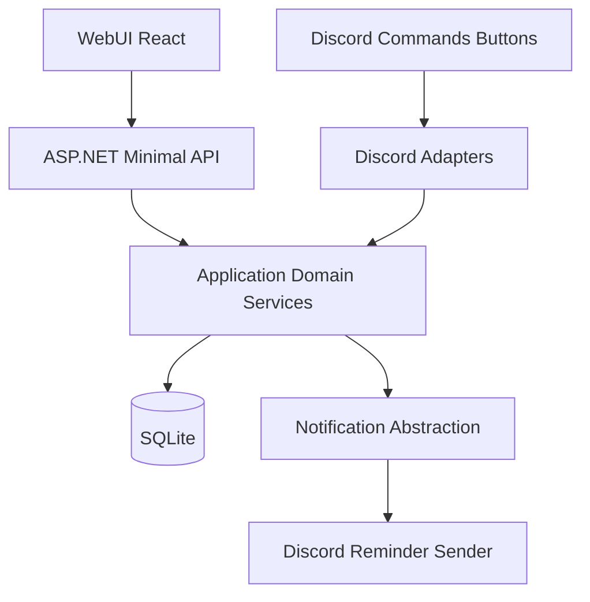

# Refined HomeBot WebUI Adaptation Plan

## Objectives
- Keep existing feature behavior (buy, wishlist, money, calendar, undo) while exposing it to a Web UI.
- Remove Discord presentation concerns from services so command handlers and API both consume the same domain operations.
- Ship a usable single-household web experience first, with explicit upgrade path to user auth later.

## Implementation status (current codebase)

| Area | Status |
|------|--------|
| Domain models / list DTOs (`*ListItemModel`, `PagedResult`, etc.) | In place; services expose non-Discord shapes for lists and mutations. |
| Household-facing labels (`HouseholdIdentity`) | In place for neutral display where needed. |
| Buy writes in `BuyService` | In place (shared by Discord and API). |
| SQLite registration | `AddHomeBotDataServices()` in `Composition/HomeBotDataServices.cs`; optional `DatabaseService(path)` for tests. |
| HTTP API | **Minimal APIs** in `Api/HomeBotApiRegistration.cs`, hosted via `Api/HomeBotApiHost.cs` (not MVC controllers). |
| Process layout | Same process: optional Discord client + optional Kestrel API (`Program.cs`). API-only mode: `HOMEBOT_DISCORD_ENABLED=false` and `HOMEBOT_API_ENABLED=true`. |
| Security (v1) | Bearer `HOMEBOT_API_TOKEN` on `/api/*` except `/api/health` and `/api/meta`; CORS from `HOMEBOT_ALLOWED_ORIGINS` or default dev origin; HTTPS/HSTS when not Development. |
| REST mutations | Buy, wishlist, money, calendar, undo mapped under `/api/…` with `actorUserId` query where required. |
| Integration tests | `HomeBot.Tests/ApiMutationTests.cs` — xUnit + `WebApplicationFactory`-style host, isolated temp SQLite per test class instance; covers health/meta, auth, buy CRUD + undo-after-delete, wishlist, money, calendar. |
| WebUI (`webui/`) | **Vite + React** client: `api.ts` wraps routes; `App.tsx` is a **functional API smoke / mutation console** (tabs, forms, raw JSON output) — suitable for exercising the API, not yet a polished product UI. |
| Phase 3 items (rate limits, OpenAPI, shared validators, response envelopes) | **Not done** — still planned. |

**Notable fixes already applied:** SQLite deadlocks avoided by not calling `UndoService.LogAction` while a `DataReader` is still open (e.g. `BuyService.DeleteItem`), and by not calling `DeleteLastAction` inside the same open connection scope as the undo restore SQL in `UndoService.ApplyLastUndo`.

## Current constraints (updated from discovery)
- Many flows still have Discord-specific `Build*` helpers on services that compose embeds/components; these sit **beside** DTO/query APIs the HTTP layer uses. Further consolidation is optional cleanup, not a blocker for API + WebUI smoke testing.
- HTTP surface is **minimal route delegates** with a shared `IServiceProvider` root (same pattern in tests), not a separate controller assembly.
- Slash commands and button handlers remain the other transport; parity is maintained by calling the same services.

## Target architecture (single-household first)

## Security model (WebUI to API)
- **Frontend trust model:** Static/Vite build contains no secrets; all trust decisions happen at API.
- **Transport security:** enforce HTTPS-only access to API in non-Development; local dev may use HTTP.
- **Authentication (single-household v1):** require app-level bearer token (`Authorization: Bearer …`) for all `/api/*` except `/api/health` and `/api/meta` when `HOMEBOT_API_TOKEN` is configured (empty token yields 503 on protected routes in middleware).
- **Token storage:** `HOMEBOT_API_TOKEN` (and `DISCORD_TOKEN`, etc.) in environment only; never in repo or frontend source.
- **CORS policy:** `HOMEBOT_ALLOWED_ORIGINS` comma-separated list, or default `http://localhost:5173` for Vite.
- **Abuse protection:** per-IP rate limiting and request body size limits on mutation endpoints — **still to add** (Phase 3).
- **API hardening:** validate inputs server-side; avoid leaking stack traces in production — partial (validation helpers exist; production error shape not fully standardized).
- **Operational security:** keep SQLite file and host non-public; expose API behind firewall/reverse proxy where possible.
- **Future-ready:** `actorUserId` query parameter preserves a path to real identity once OAuth or local accounts exist.

**Runtime toggles (reference):**
- `HOMEBOT_API_ENABLED=true` — start Kestrel (`HOMEBOT_API_URL`, default `http://0.0.0.0:5050`).
- `HOMEBOT_DISCORD_ENABLED=false` — skip Discord gateway; run API only (after `ConfigureServices()` still builds data services).
- `HOMEBOT_DATABASE_PATH` — SQLite file or `Data Source=…` string for the live app (tests use explicit `DatabaseService(path)` instead to avoid parallel env races).

## Phase 1: Split domain data from Discord presentation
**Largely complete** for API consumption paths.
- Feature models/DTOs and paged results exist for list and detail flows used by services.
- Pure query/mutation methods exist without `Embed`/button construction for the REST layer; Discord adapters still call `Build*` where not yet refactored.
- Buy write operations live in `BuyService` for shared use.
- `HouseholdIdentity` provides neutral labels for web-facing display.

*Remaining optional work:* further trim or relocate remaining `Build*` surface into thin Discord-only adapter types if desired.

## Phase 2: Add web API host in the existing app
**Complete** for the initial REST scope.
- Kestrel runs in the same process; shared `IServiceProvider` from `Program.ConfigureServices()` is passed into `HomeBotApiHost.Configure`.
- `/api/health` and `/api/meta` for deploy verification.
- CORS + bearer gate + non-Development HTTPS behavior in `HomeBotApiHost`.
- Feature endpoints map to services (calendar, money, wishlist, buy, undo) with REST-style paths under `/api`.
- WebUI default base URL `http://localhost:5050` (`VITE_API_BASE_URL` override).

## Phase 3: Validation, contracts, error handling, and security middleware
**In progress / not started** (prioritize based on exposure).
- Centralize validation rules shared by API and Discord where duplication remains.
- Standardize API response envelopes and error shapes (400/404/409).
- Rate limiting and request size limits on writes.
- Structured logging with redaction.
- OpenAPI/Swagger for contract docs.
- **Integration tests:** HTTP mutation suite exists; extend with edge cases, concurrency, and Discord vs API parity checks as needed.

## Phase 4: Web UI rollout (React + Vite + Tailwind)
**Early stage — API-first tooling, not final product UX.**
- `webui/src/api.ts` implements list + mutation helpers for all four domains + undo.
- `webui/src/App.tsx` provides per-tab forms and JSON output for manual verification.
- Next step when ready: replace smoke layout with real list/detail/create/edit flows, shared pagination/filter UX, and dashboard composition once API contracts stabilize.

## Phase 5: Future-ready identity/auth path
Unchanged intent: v1 household bearer + explicit `actorUserId`; later OAuth or local accounts with ID mapping.

## Specific refinements applied vs. original `HomeBot_WebUI_Plan.md` notes
- Adapter layer remains the Discord command/button path vs. minimal HTTP routes.
- Service refactor split: domain models + Discord `Build*` wrappers coexist today.
- REST resource routes under `/api` are in use.
- Single-household auth and evolution plan remain as documented above.
- WebUI/API security section matches implemented CORS + bearer + HTTPS behavior; rate limiting still to add.
- Parity checklist per feature remains a good manual regression habit (Discord + WebUI against same DB).

## Recommended file touch order (when extending)
- `Api/HomeBotApiHost.cs`, `Api/HomeBotApiRegistration.cs`
- `Program.cs`
- `Composition/HomeBotDataServices.cs`
- `Services/*.cs` (domain changes)
- `Commands/*Commands.cs` (Discord adapter only)
- `webui/src/api.ts`, `webui/src/App.tsx`
- `HomeBot.Tests/ApiMutationTests.cs`

## Success criteria
- Discord commands remain functional without behavior regressions (when Discord enabled).
- API can perform CRUD + list flows for buy, wishlist, money, and calendar, plus undo, using shared services — **verified by integration tests for core HTTP paths.**
- Web UI can drive the same workflows via `api.ts` — **smoke UI in place;** polished workflows tracked under Phase 4.
- Clear boundaries: domain services vs Discord presentation vs HTTP mapping.
- API accepts browser traffic only from configured origins; protected routes require bearer token.
- No secrets in frontend artifacts or source control.
