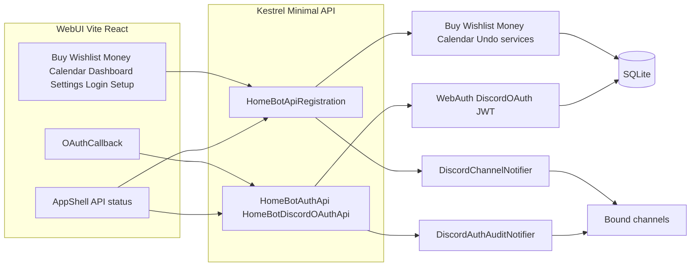

# Refined HomeBot WebUI Adaptation Plan

**Last updated:** 2026-05-02 — aligned with repo state after **refreshable web sessions** (short-lived access JWT + **`WebRefreshTokens`** rotation, **`POST /api/auth/refresh`** / **`logout`**), plus **web household auth** (password, Discord-verified bootstrap/register, **optional Discord OAuth**), **`/login` / `/setup` / `/oauth/callback`**, **Discord auth audit**, **auth rate limits** (`HomeBotApiPhase3` incl. **`auth_refresh`**), **non-Development** partial-OAuth guard, **operational UX**, **router `basename`**, env templates, **tests** (`ApiWebAuthTests` refresh rotation), assembly **`DisableTestParallelization`**, and earlier **calendar time zones**, **Phase 4 shell**, **route simplification** (dedicated **`/health`** page optional; no **`/undo`** route; **Workspace** removed).

**How to use this doc (agents):** Treat the [Implementation snapshot](#implementation-snapshot) and [WebUI routes and pages](#webui-routes-and-pages) sections as source of truth for what exists. Prefer opening the cited files over inferring behavior. Phases 1–3 and backend API work are **shipped**; Phase 4 includes feature pages **and** sign-in / account flows; Phase 5 (identity) is **partially shipped** for single-household JWT (access + refresh) + optional OAuth linked to an existing user. **Multi-tenant / SSO** and **OAuth-only account provisioning** are **not planned** (see [WebUI_Future_Work.md](./WebUI_Future_Work.md) **Explicitly not backlog**).

---

## Objectives (unchanged)

- Keep existing feature behavior (buy, wishlist, money, calendar, undo) while exposing it to a Web UI.
- Remove Discord presentation concerns from services where practical so command handlers and API share domain operations.
- Ship a usable single-household web experience first; `actorUserId` preserves a path to richer identity later.

---

## Implementation snapshot

| Area | Status |
|------|--------|
| Domain models / list DTOs (`*ListItemModel`, `PagedResult`, etc.) | **Shipped** — services expose non-Discord shapes for lists and mutations. |
| Household-facing labels (`HouseholdIdentity.MemberLabel` → `member-{id}`) | **Shipped** — neutral fallback; **WebUI must not rely on JSON numeric ids** for large Discord snowflakes (see [Snowflakes in the browser](#snowflakes-in-the-browser)). |
| Buy / wishlist tag catalogs (`Settings` CSV via `ConfigService`) | **Shipped** — GET + PUT catalog endpoints; enforced on writes when catalog non-empty. |
| Buy / wishlist / money HTTP surface | **Shipped** — `Api/HomeBotApiRegistration.cs`; wishlist owners GET for filters. |
| Money POST bodies (`paidBy`, `owedBy`, `receivedBy`) | **Shipped** — JSON **strings** + `Serialization/SnowflakeUlongJsonConverter.cs` on request DTO `ulong` fields so full snowflakes round-trip from JS. |
| Calendar POST `assignedToUserId` | **Shipped** — JSON **strings** (or numbers) via `Serialization/SnowflakeUlongNullableJsonConverter.cs` on `Models/ApiRequests.cs` `CalendarItemCreateRequest`. |
| Calendar range + recurrence | **Shipped** — `GET /api/calendar/range?from&to&userFilter` (local `YYYY-MM-DD` bounds, max 92 days) returns `Models/CalendarRangeItemModel.cs` rows with `instanceStartUtc` / `instanceEndUtc` / `isRecurringInstance` / **`timeZoneId`** (event row zone); optional query **`timeZone`** = IANA (or Windows id where the host supports it) sets the **window** for interpreting `from`/`to` and expansion math (`CalendarService.GetRange(..., windowTimeZoneId)`). `Utils/TimeZoneResolver.cs` resolves ids cross-platform (direct + Windows↔IANA when the runtime allows). Household default zone when unset: **`UTC`** (config key `timezone`). |
| Calendar list filter | **Shipped** — `GET /api/calendar` and `GET /api/calendar/items?type=task|event&page=…` |
| Calendar create / PATCH body `timezone` | **Shipped** — optional on create and update; wall times interpreted in that zone; defaults to household Settings timezone (`Models/ApiRequests.cs`). |
| SQLite / DI | `Composition/HomeBotDataServices.cs`; tests may use `DatabaseService(path)`. |
| HTTP host | **Minimal APIs** — `Api/HomeBotApiRegistration.cs`, **`Api/HomeBotAuthApi.cs`**, **`Api/HomeBotDiscordOAuthApi.cs`**, `Api/HomeBotApiHost.cs` (not MVC). |
| Process layout | Same process: optional Discord + optional Kestrel (`Program.cs`). API-only: `HOMEBOT_DISCORD_ENABLED=false`, `HOMEBOT_API_ENABLED=true`. |
| Security (v1) | Bearer **`HOMEBOT_API_TOKEN`** and/or **HS256 JWT** (`HOMEBOT_WEB_JWT_SECRET`, ≥32 UTF-8 bytes) on `/api/*` except **`/api/health`**, **`/api/meta`**, **`/openapi/*`**, and **public auth routes** (see [Public auth](#public-auth-no-authorization-header)). **Rate limits:** separate fixed-window policies per client IP for login, refresh/logout, OAuth consume/browser, account-write bundle, Discord status poll (`Api/HomeBotApiPhase3.cs` + `RequireRateLimiting` on `HomeBotAuthApi` / `HomeBotDiscordOAuthApi`); **`429`** + `Retry-After` on abuse (env-tunable; see README **Auth rate limits**). CORS **`HOMEBOT_ALLOWED_ORIGINS`** or dev default; **OAuth SPA origin** from **`HOMEBOT_WEB_OAUTH_FRONTEND_URL`** merged into CORS when missing. HTTPS/HSTS when not Development. **Production:** incomplete OAuth triple → startup exception (`HomeBotApiHost.ValidateAuthEnvironmentForHosting` from **`Program`**). |
| Web users / JWT | **Shipped** — `WebUsers` + `WebAuthService` + **`WebRefreshTokenService`** (`Services/WebRefreshTokenService.cs`, `WebAuthSessionResponse`); short-lived access JWT (`HomeBotJwtTokens.AccessTokenLifetimeSeconds`); `POST /api/auth/login` and OAuth **consume** return **`accessToken`** + **`refreshToken`** + expiries; **`POST /api/auth/refresh`** rotates refresh; **`GET /api/auth/me`** (bearer). |
| Web sign-up (Discord verify in guild) | **Shipped** — `WebAuthDiscordVerificationService` + `POST/GET` under `/api/auth/discord/*` (start, status, complete-bootstrap, complete-register); bot **`/webui-verify`**; optional **`HOMEBOT_WEB_SETUP_TOKEN`** / **`HOMEBOT_WEB_INVITE_TOKEN`**. |
| Discord OAuth (browser) | **Shipped** — `Services/DiscordOAuthService.cs`, `Api/HomeBotDiscordOAuthApi.cs` (authorize URL, callback, consume); exchange table **`WebOAuthExchangeCodes`**; refresh table **`WebRefreshTokens`**; env `HOMEBOT_DISCORD_OAUTH_*`, **`HOMEBOT_WEB_OAUTH_FRONTEND_URL`**. Signs in only when **`WebUsers.DiscordUserId`** already matches (same row as password login). |
| Discord auth audit | **Shipped** — `Services/DiscordAuthAuditNotifier.cs` posts to channel bound as feature **`audit`** (`/setup-set audit #channel`) on successful **password** and **Discord OAuth** sign-in. |
| Integration tests | `HomeBot.Tests/ApiMutationTests.cs`, `ApiPhase3Tests.cs`, **`ApiWebAuthTests.cs`**, **`ApiAuthRateLimitTests.cs`**. |
| Phase 3 | **Shipped** — `Api/HomeBotApiPhase3.cs`: mutation rate limit + **auth-specific** rate limits, max body, OpenAPI, errors, HTTP logging. |
| Discord notify on API creates | **Shipped** — `IDiscordChannelNotifier` after POST creates (buy, wishlist, money, calendar); needs bindings + connected bot. |
| Calendar range unit tests | `HomeBot.Tests/CalendarServiceRangeTests.cs` — recurrence + filter + window cap. |
| Time zone resolver unit tests | `HomeBot.Tests/TimeZoneResolverTests.cs` — cross-platform id resolution / storage id. |
| WebUI (Vite + React + Tailwind) | **Phase 4** — same as before **plus** **`LoginPage`** / **`SetupPage`** / **`OAuthCallbackPage`** / **`HealthPage`** (`/health`); **`AuthContext`** + **`auth/storageKeys.ts`** (`token`, refresh in **localStorage**, `actorUserId`, `webUsername`, `applyWebLogin`); **`apiJson`** silent refresh on **401**; **`BrowserRouter`** **`basename`** from `import.meta.env.BASE_URL` (`main.tsx`). Feature pages: **Buy**, **Wishlist**, **Money**, **Calendar** + **Dashboard** + **Settings** + shell status. **No** Workspace/undo-only routes. |
| Discord (household timezone UX) | **Shipped (bot)** — `/timezone-set` (autocomplete), `/timezone-list`, validated `/config-set timezone`; storage prefers **IANA** via `TimeZoneResolver.ToStorageId` so Linux and Windows share the same SQLite. |

**Fixes worth remembering:** SQLite deadlocks avoided by not calling `UndoService.LogAction` while a `DataReader` is open (`BuyService.DeleteItem`), and not calling `DeleteLastAction` inside the same open connection as undo-restore SQL (`UndoService.ApplyLastUndo`).

**Operational:** If API writes succeed but Discord is silent, check `ChannelBindings` for keys `buy`, `wishlist`, `money`, `calendar`. For **web sign-in audit** lines, bind feature **`audit`** (`/setup-set audit #channel`). **`HomeBotApiHost.LogOperationalWarnings`** (API enabled) prints console hints for missing token/JWT, incomplete OAuth triple, bad redirect URI shape, and CORS merge. Env reference: **`.env.example`**, **`README.md`** — the .NET host does not auto-load `.env`; inject vars via IDE / systemd / Docker / shell. **Tests:** `HomeBot.Tests/AssemblyInfo.cs` sets **`DisableTestParallelization`** because fixtures set process-global **`HOMEBOT_WEB_JWT_SECRET`**.

---

## WebUI routes and pages

Router: `webui/src/App.tsx`. **`/oauth/callback`** is a **top-level** route (no `AppShell` chrome) so Discord’s redirect lands on a minimal page; everything else below is wrapped in **`AppShell`**. `webui/src/main.tsx` wraps the tree in **`AuthProvider`** + **`CalendarZoneProvider`** and sets **`BrowserRouter`** **`basename`** from Vite `import.meta.env.BASE_URL` (strip trailing `/`; omit when root).

| Path | Shell? | Component | Purpose |
|------|--------|-----------|---------|
| `/oauth/callback` | No | `OAuthCallbackPage` | Reads `oauth_code` / `oauth_error` from query; **`POST /api/auth/discord/oauth/consume`** once (StrictMode-safe); **`applyWebLogin`** → **`navigate("/", { replace: true })`** to **Home** (`DashboardPage`). |
| `/` | Yes | `DashboardPage` | Hub with **per-feature snapshots** (buy, wishlist, money summary + recent tx, calendar today / upcoming / tasks) when a bearer token is set; links to feature pages. |
| `/login` | Yes | `LoginPage` | Username/password **`POST /api/auth/login`**; optional **Continue with Discord** → `GET /api/auth/discord/oauth/url` then full-page redirect to Discord. |
| `/setup` | Yes | `SetupPage` | New household / invite flows: Discord verify (`/api/auth/discord/start` + status polling + complete) or manual bootstrap/register when configured. |
| `/settings` | Yes | `SettingsPage` | API base URL, bearer token (or JWT from login), **`actorUserId`**, **calendar viewer time zone** (`TimeZoneSelect` + `CalendarZoneContext`); persisted via `AuthContext` / zone provider. |
| `/health` | Yes | `HealthPage` | Bookmarkable **`/api/health`** + **`/api/meta`** JSON; **Diagnostics** link from **`AppShell`**. |
| `/buy` | Yes | `BuyPage` | Tag catalog editor, tag filter + sort, add form (roster assignee), list with complete/remove, clear completed, pagination, **Undo last action** under pagination when list non-empty. |
| `/wishlist` | Yes | `WishlistPage` | Same catalog pattern as buy; **owner filter** (everyone vs user); roster or `GET /api/wishlist/owners`; add/complete/remove/clear completed; pagination; **Undo** under pagination. |
| `/money` | Yes | `MoneyPage` | Transactions table (roster-aware names; subline = exact id from `member-{id}` parse); **split expense only** (no non-split expense UI); **record payment**; pairwise **balance** (summary uses roster usernames when possible); pagination; **Undo** under pagination. |
| `/calendar` | Yes | `CalendarPage` | **Month / Week / Day / Agenda** views; `GET /api/calendar/range` for the visible window with **`timeZone`** from the **viewer zone**; **Tasks** side panel (`?type=task`) stacks below on narrow screens; filter (everyone / me / user); **+ Event** / **+ Task** modals (optional event **time zone**); item detail (PATCH / complete / delete); per-row **time zone** hints when event zone differs from display zone; recurring-instance banner; **Undo** in-page. URL state: `?view=` & `?date=`. |

**Removed / superseded:** **`WorkspacePage`** and a dedicated **`/undo`** route — **Undo** remains on **Buy / Wishlist / Money / Calendar** only. **`/health`** is an optional bookmarkable **diagnostics** page (`HealthPage`); day-to-day reachability is still summarized in **`AppShell`** (`useApiConnectionStatus`: health + meta + optional authenticated probe).

**Nav:** `webui/src/layout/AppShell.tsx` — sidebar: Home, Buy, Wishlist, Money, Calendar, Settings; footer links: **Sign in** (`/login`), **New account** (`/setup`).

---

## WebUI patterns (for agents)

### Auth

- `webui/src/auth/AuthContext.tsx` + **`auth/storageKeys.ts`** — **`token`** (API token or access JWT from web login), **`actorUserId`**, **`webUsername`**, `applyWebLogin` / `clearSession`; **`localStorage`** for token, refresh, actor, username. **`apiJson`** on **401** calls **`postAuthRefresh`** once using the stored refresh token, then retries the request.
- **Sign-in paths:** (1) **Password** — `POST /api/auth/login` → access JWT + **refreshToken** + fills `actorUserId` from profile. (2) **Discord OAuth** — `getDiscordOAuthUrl` → user authorizes on Discord → API callback stores short-lived exchange → browser opens **`/oauth/callback?oauth_code=…`** → `postDiscordOAuthConsume` → same session shape as password. OAuth requires server env (`HOMEBOT_DISCORD_OAUTH_*`, `HOMEBOT_WEB_JWT_SECRET`) and an existing **`WebUsers`** row with matching **`DiscordUserId`**.
- **Bearer** — required for almost all **`/api/*`** calls **after** auth middleware (see **API quick reference** → **Public auth** below).
- **`actorUserId`** — Discord snowflake string; required for mutations that send `?actorUserId=` (buy/wishlist add, complete, delete item; money delete; calendar delete/complete; **all** `postUndo` calls). Web login sets it from the signed-in user’s **`discordUserId`**.

### Guild roster

- `webui/src/hooks/useDiscordGuildRoster.ts` — `GET /api/discord/guild/members` once per token.
- When `available === false`, UIs fall back to numeric id inputs or `GET /api/wishlist/owners` for wishlist owner lists.

### Undo (global stack)

- `POST /api/undo?actorUserId=…` — reverts **one** latest undoable `ActionLog` row for that actor (any domain), not “current page only.”
- **Product UX:** `postUndo` in `api.ts` returns `UndoResponse` `{ undone, message? }`; `200` with `undone: false` means nothing to undo — not an HTTP error.
- Buttons: bottom of pagination on **Buy**, **Wishlist**, **Money** when `totalCount > 0`; **Calendar** exposes Undo below the main grid. There is **no** separate Undo debug page; use browser devtools or `curl` against `POST /api/undo` if needed.

### Calendar (WebUI + range API)

- **Grid data** comes from `GET /api/calendar/range` (not from paging all items). **Tasks** use `GET /api/calendar/items?type=task`.
- **Viewer time zone:** persisted in `localStorage` (`CalendarZoneContext`), configurable on **Settings** and **Calendar**; passed as query **`timeZone`** on range requests so the server’s window matches what the user sees (`api.ts` `getCalendarRange`). Fallback: browser `Intl` default (`calendarZoned.ts`).
- **Event time zones:** create/update payloads may include **`timezone`**; list/range rows expose **`timeZoneId`** for display (e.g. Agenda row subline when different from the viewer zone).
- **Recurrence:** the server expands **daily** / **weekly** into one row per occurrence in the requested window (`isRecurringInstance`). **Complete** and **Delete** on **`/api/calendar/items/{id}`** still target the **parent row** (whole series).
- **Per-instance:** `POST …/omit-instance`, `POST …/complete-instance`, `PATCH …/instance` (body uses canonical range **`instanceStartUtc`**); range may set **`displayInstanceStartUtc`**, **`isInstanceCompleted`**, **`hasInstanceOverride`**. **Undo** restores exception rows. **Reminders** skip suppressed occurrences.

### Snowflakes in the browser

- **Never** trust `number`-typed `ulong` fields from JSON for IDs **> 2^53−1** (precision loss). Patterns in codebase:
  - **Money summary / table:** parse exact id from `member-{digits}` in `*MemberLabel`, or keep query string ids from forms (`MoneyPage.tsx`).
  - **Money POST:** request bodies send **digit strings**; server uses `SnowflakeUlongJsonConverter` on `MoneyExpenseCreateRequest` / `MoneyExpenseSplitCreateRequest` / `MoneyPaymentCreateRequest` participant fields.
  - **Calendar POST (`assignedToUserId`):** WebUI sends **digit strings**; server uses `SnowflakeUlongNullableJsonConverter` on `CalendarItemCreateRequest`.
  - **Other `jsonUlong` callers in `api.ts`:** still enforce safe integers — fine for smaller test ids; real Discord ids may need the same string+converter treatment if those endpoints are exercised with large snowflakes.

---

## API quick reference (`actorUserId`)

### Public auth (no `Authorization` header)

- `POST /api/auth/login`, `POST /api/auth/bootstrap`, `POST /api/auth/register`
- `POST /api/auth/refresh`, `POST /api/auth/logout`
- `POST /api/auth/discord/start`, `GET /api/auth/discord/status`, `POST /api/auth/discord/complete-bootstrap`, `POST /api/auth/discord/complete-register`
- `GET /api/auth/discord/oauth/url`, `GET /api/auth/discord/oauth/callback`, `POST /api/auth/discord/oauth/consume`

These routes are subject to **per-IP rate limiting** (see **`HomeBotApiPhase3`** policies `auth_login`, `auth_refresh`, `auth_account_write`, `auth_discord_status_poll`, `auth_oauth_browser`, `auth_oauth_consume`); excessive traffic returns **`429`** with body **`code: rate_limited`** (same shape as mutation rate limit).

All other **`/api/*`** routes (except **`/api/health`**, **`/api/meta`**, **`/openapi/*`**) require **`Authorization: Bearer`** with either **`HOMEBOT_API_TOKEN`** or a valid **access JWT** from login / OAuth consume / refresh. **`GET /api/auth/me`** requires bearer.

### Query `actorUserId` required

- Buy: POST item, POST complete, DELETE item  
- Wishlist: POST item, POST complete, DELETE item  
- Money: DELETE transaction  
- Calendar: POST complete, DELETE item  
- Undo: POST `/api/undo`

### Bearer only (typical)

- Money: POST expenses, POST expenses/split, POST payments; PATCH transaction  
- Calendar: POST create, PATCH item; **GET** `/api/calendar/range`; **GET** `/api/calendar/items` (optional `type`); **GET** `/api/calendar/items/{id}` (optional query **`instanceStartUtc`** for merged recurrence occurrence); **DELETE** `/api/calendar/items/{id}/instance?instanceStartUtc=…` clears per-day overrides (same slot key as range rows)  
- Buy: PUT item, PUT `/api/buy/tags`, DELETE completed  
- Wishlist: DELETE completed, PUT `/api/wishlist/tags`  
- Catalog reads: GET `/api/buy/tags`, GET `/api/wishlist/tags`, GET `/api/wishlist/owners`

### Phase 3 artifacts

- Errors: `{ "error", "code" }` — `Api/ApiResults.cs`, `Api/ApiErrorBody.cs`  
- Mutations: `RequireRateLimiting("mutation")` on write group under `/api` (feature writes)  
- **Auth rate limits:** `RequireRateLimiting(...)` on `HomeBotAuthApi` / `HomeBotDiscordOAuthApi` routes; optional overrides in `AddPhase3Services(..., authLoginPerMinute: …)` for tests  
- Body cap: `HomeBotApiPhase3` + env `HOMEBOT_API_MAX_BODY_BYTES`  
- OpenAPI: `GET /openapi/v1.json` (calendar GET item + DELETE instance carry human-readable **`instanceStartUtc`** descriptions via `Api/CalendarRouteOpenApi.cs`)  
- Tests configure Phase 3 via `AddPhase3Services(...)`

---

## Discord + API startup (notifications)

**Issue fixed:** `DiscordSocketClient` was not reliably available to the API if resolved too early.

**Current:** `DiscordSocketHolder` holds `Client`; `Program` assigns client to holder before starting API; `DiscordChannelNotifier` uses holder. Until gateway connected, notify is effectively no-op.

**Auth audit:** `DiscordAuthAuditNotifier` sends a one-line markdown message to the channel bound for feature **`audit`** (`Commands/SetupCommands.cs` **`/setup-set audit #channel`**) after successful **password** or **Discord OAuth** web sign-in (`Api/HomeBotAuthApi.cs`, `Api/HomeBotDiscordOAuthApi.cs`). Uses the same **`IDiscordChannelNotifier`** path as feature POST notifications.

**Files:** `Program.cs`, `Services/DiscordSocketHolder.cs`, `Services/DiscordChannelNotifier.cs`, `Services/DiscordAuthAuditNotifier.cs`, `Services/DiscordGuildDirectoryService.cs` (guild members for WebUI), `Api/HomeBotApiRegistration.cs`, `Api/HomeBotAuthApi.cs`, `Api/HomeBotDiscordOAuthApi.cs`.

---

## Phases (status)

### Phase 1 — Domain vs Discord presentation

**Largely complete.** DTOs + service methods for HTTP; Discord `Build*` helpers may still exist alongside.

### Phase 2 — Web API host

**Complete** for initial REST scope (`HomeBotApiHost`, health/meta, feature routes).

### Phase 3 — Validation, errors, limits, OpenAPI

**Shipped** — see `Api/HomeBotApiPhase3.cs` (mutation + **public auth** rate limits), `Api/HomeBotApiHost.cs` (**`ValidateAuthEnvironmentForHosting`**, **`LogOperationalWarnings`**, **`ResolveCorsOrigins`**), tests in `HomeBot.Tests` including **`ApiAuthRateLimitTests`**.

### Phase 4 — Product Web UI

| Item | Status |
|------|--------|
| `api.ts` typed clients + money string snowflakes + `UndoResponse` | **Done** |
| Buy / Wishlist / Money full pages | **Done** |
| Dashboard + Settings + shell | **Done** — Dashboard loads multi-feature snapshots; shell shows API connection status |
| Calendar product page (replace `WorkspacePage` console) | **Done** — `CalendarPage` + `webui/src/calendar/*` |
| Calendar time zones (viewer zone, range `timeZone`, per-event `timezone` / `timeZoneId`) | **Done** — see [Calendar (WebUI + range API)](#calendar-webui--range-api) |
| Health as dedicated minimal page (optional) | **Done** — **`HealthPage`** at **`/health`** (raw health/meta JSON); **`AppShell`** still shows live status |
| Consolidate or remove redundant `/undo` nav entry vs in-page Undo | **Done** — `/undo` route and Workspace **removed**; in-page Undo only |
| **Login / Setup / OAuth callback** | **Done** — `LoginPage`, `SetupPage`, `OAuthCallbackPage`; `api.ts` auth helpers |
| **Router basename** (subpath deploys) | **Done** — `main.tsx` + `BrowserRouter` |
| **Auth rate limits + prod OAuth env guard** | **Done** — `HomeBotApiPhase3` + `HomeBotAuthApi` / `HomeBotDiscordOAuthApi`; `ValidateAuthEnvironmentForHosting` + README / `.env.example` |

### Phase 5 — Identity

**Partially shipped (single household):** Short-lived access JWT + rotating opaque **refresh** token (`WebRefreshTokens`, `WebRefreshTokenService`) alongside **`WebUsers`** (`username`, password hash, **`DiscordUserId`**); optional **Discord OAuth** for the same row; optional **`HOMEBOT_API_TOKEN`** for scripts; **`actorUserId`** still used for mutation “who” on domain APIs. **Not planned:** multi-tenant / SSO, OAuth-driven **`WebUsers`** creation without prior row (see **[WebUI_Future_Work.md](./WebUI_Future_Work.md)**). **Not in scope here:** httpOnly cookie transport (SPA continues to use localStorage for tokens).

---

## Key files (agent index)

| Concern | Files |
|---------|--------|
| Routes | `webui/src/App.tsx`, `webui/src/layout/AppShell.tsx` |
| API client | `webui/src/api.ts` |
| API connection status (shell) | `webui/src/hooks/useApiConnectionStatus.ts` |
| Auth pages | `webui/src/pages/LoginPage.tsx`, `SetupPage.tsx`, `OAuthCallbackPage.tsx` |
| Feature pages | `webui/src/pages/BuyPage.tsx`, `WishlistPage.tsx`, `MoneyPage.tsx`, `CalendarPage.tsx` |
| Calendar UI modules | `webui/src/calendar/` (`MonthView`, `TimeGridView`, `AgendaView`, `TasksPanel`, `AddItemModal`, `ItemDetailModal`, `dateUtils`, `CalendarZoneContext`, `calendarZoned`, `timeZoneOptions`) |
| Shell / hub / settings / diagnostics | `webui/src/pages/DashboardPage.tsx`, `SettingsPage.tsx`, `HealthPage.tsx`, `auth/AuthContext.tsx`, `auth/storageKeys.ts`, `components/TimeZoneSelect.tsx` |
| App entry (providers + basename) | `webui/src/main.tsx` (`AuthProvider`, `CalendarZoneProvider`, `BrowserRouter`) |
| Roster hook | `webui/src/hooks/useDiscordGuildRoster.ts` |
| HTTP registration (features) | `Api/HomeBotApiRegistration.cs` |
| Web auth APIs | `Api/HomeBotAuthApi.cs`, `Api/HomeBotDiscordOAuthApi.cs` |
| Host + Phase 3 + auth gate + ops diagnostics | `Api/HomeBotApiHost.cs` (`Configure`, **`ValidateAuthEnvironmentForHosting`**, **`LogOperationalWarnings`**, **`ResolveCorsOrigins`** / **`TryGetOAuthSpaOrigin`**), `Api/HomeBotApiPhase3.cs` |
| Money JSON ulong | `Serialization/SnowflakeUlongJsonConverter.cs`, `Models/ApiRequests.cs` (money request types) |
| Calendar range DTO + JSON ulong (nullable) | `Models/CalendarRangeItemModel.cs`, `Serialization/SnowflakeUlongNullableJsonConverter.cs`, `Services/CalendarService.cs` (`GetRange`) |
| Time zone resolution (API + bot) | `Utils/TimeZoneResolver.cs`, `Utils/HomeBotTimeZones.cs`, `Commands/ConfigCommands.cs`, `Commands/TimezoneAutocompleteHandler.cs` |
| Error DTOs | `Api/ApiErrorBody.cs`, `Api/ApiResults.cs` |
| DI | `Composition/HomeBotDataServices.cs` |
| Web auth services | `Services/WebAuthService.cs`, `Services/WebAuthDiscordVerificationService.cs`, `Services/DiscordOAuthService.cs`, `Services/HomeBotJwtTokens.cs` |
| Process | `Program.cs` |
| Discord notify + audit | `Services/DiscordChannelNotifier.cs`, `Services/DiscordAuthAuditNotifier.cs`, `Utils/DiscordNotifyText.cs` |
| Bindings | `Services/ChannelBindingService.cs`, `Commands/SetupCommands.cs` |
| Wishlist tags / owners | `Services/WishlistService.cs` |
| Tests | `HomeBot.Tests/ApiMutationTests.cs`, `ApiPhase3Tests.cs`, **`ApiWebAuthTests.cs`**, **`ApiAuthRateLimitTests.cs`**, `CalendarServiceRangeTests.cs`, `TimeZoneResolverTests.cs`; **`HomeBot.Tests/AssemblyInfo.cs`** (xUnit **`DisableTestParallelization`**) |
| Env docs | **`.env.example`**, **`README.md`**, **`webui/.env.example`** |

---

## Architecture (reference)

---

## Success criteria (regression mindset)

- Discord commands still work when Discord enabled (shared services).
- API + tests cover core HTTP paths for buy, wishlist, money, calendar, undo, and **web auth** (`ApiWebAuthTests`, **`ApiAuthRateLimitTests`** for login **`429`**).
- WebUI: buy / wishlist / money / **calendar** are usable end-to-end with token + `actorUserId` where required (complete/delete/undo on calendar); **login** (password or OAuth when configured) yields JWT + populated **`actorUserId`** for the same flows.
- No secrets in frontend source (`HOMEBOT_WEB_JWT_SECRET` / API token / OAuth client secret stay server-side); bearer enforced server-side on protected routes; CORS + **`HOMEBOT_WEB_OAUTH_FRONTEND_URL`** aligned with actual UI origin in non-local deploys; public auth endpoints return **`429`** when rate-limited; non-Development host refuses **partial** OAuth env (unless explicitly allowed).
