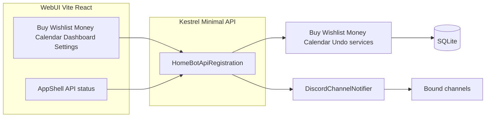

# Refined HomeBot WebUI Adaptation Plan

**Last updated:** 2026-05-02 — aligned with repo state after **calendar time zones** (viewer zone + per-event zones + API range window), **Phase 4 shell polish** (API connection status in the header, richer **Dashboard** snapshots), and **route simplification** (no dedicated `/health` or `/undo` pages; **Workspace** removed from the app router).

**How to use this doc (agents):** Treat the [Implementation snapshot](#implementation-snapshot) and [WebUI routes and pages](#webui-routes-and-pages) sections as source of truth for what exists. Prefer opening the cited files over inferring behavior. Phases 1–3 and backend API work are **shipped**; Phase 4 product pages are **shipped** for buy, wishlist, money, and **calendar**, with the optional UX polish items below either **done** or explicitly **deferred**.

---

## Objectives (unchanged)

- Keep existing feature behavior (buy, wishlist, money, calendar, undo) while exposing it to a Web UI.
- Remove Discord presentation concerns from services where practical so command handlers and API share domain operations.
- Ship a usable single-household web experience first; `actorUserId` preserves a path to richer identity later.

---

## Implementation snapshot

| Area | Status |
|------|--------|
| Domain models / list DTOs (`*ListItemModel`, `PagedResult`, etc.) | **Shipped** — services expose non-Discord shapes for lists and mutations. |
| Household-facing labels (`HouseholdIdentity.MemberLabel` → `member-{id}`) | **Shipped** — neutral fallback; **WebUI must not rely on JSON numeric ids** for large Discord snowflakes (see [Snowflakes in the browser](#snowflakes-in-the-browser)). |
| Buy / wishlist tag catalogs (`Settings` CSV via `ConfigService`) | **Shipped** — GET + PUT catalog endpoints; enforced on writes when catalog non-empty. |
| Buy / wishlist / money HTTP surface | **Shipped** — `Api/HomeBotApiRegistration.cs`; wishlist owners GET for filters. |
| Money POST bodies (`paidBy`, `owedBy`, `receivedBy`) | **Shipped** — JSON **strings** + `Serialization/SnowflakeUlongJsonConverter.cs` on request DTO `ulong` fields so full snowflakes round-trip from JS. |
| Calendar POST `assignedToUserId` | **Shipped** — JSON **strings** (or numbers) via `Serialization/SnowflakeUlongNullableJsonConverter.cs` on `Models/ApiRequests.cs` `CalendarItemCreateRequest`. |
| Calendar range + recurrence | **Shipped** — `GET /api/calendar/range?from&to&userFilter` (local `YYYY-MM-DD` bounds, max 92 days) returns `Models/CalendarRangeItemModel.cs` rows with `instanceStartUtc` / `instanceEndUtc` / `isRecurringInstance` / **`timeZoneId`** (event row zone); optional query **`timeZone`** = IANA (or Windows id where the host supports it) sets the **window** for interpreting `from`/`to` and expansion math (`CalendarService.GetRange(..., windowTimeZoneId)`). `Utils/TimeZoneResolver.cs` resolves ids cross-platform (direct + Windows↔IANA when the runtime allows). Household default zone when unset: **`UTC`** (config key `timezone`). |
| Calendar list filter | **Shipped** — `GET /api/calendar` and `GET /api/calendar/items?type=task|event&page=…` |
| Calendar create / PATCH body `timezone` | **Shipped** — optional on create and update; wall times interpreted in that zone; defaults to household Settings timezone (`Models/ApiRequests.cs`). |
| SQLite / DI | `Composition/HomeBotDataServices.cs`; tests may use `DatabaseService(path)`. |
| HTTP host | **Minimal APIs** — `Api/HomeBotApiRegistration.cs`, `Api/HomeBotApiHost.cs` (not MVC). |
| Process layout | Same process: optional Discord + optional Kestrel (`Program.cs`). API-only: `HOMEBOT_DISCORD_ENABLED=false`, `HOMEBOT_API_ENABLED=true`. |
| Security (v1) | Bearer `HOMEBOT_API_TOKEN` on `/api/*` except `/api/health`, `/api/meta`, `/openapi/*`; CORS `HOMEBOT_ALLOWED_ORIGINS` or dev default; HTTPS/HSTS when not Development. |
| Phase 3 | **Shipped** — `Api/HomeBotApiPhase3.cs` (limits, OpenAPI, errors, logging). |
| Discord notify on API creates | **Shipped** — `IDiscordChannelNotifier` after POST creates (buy, wishlist, money, calendar); needs bindings + connected bot. |
| Integration tests | `HomeBot.Tests/ApiMutationTests.cs`, `HomeBot.Tests/ApiPhase3Tests.cs`. |
| Calendar range unit tests | `HomeBot.Tests/CalendarServiceRangeTests.cs` — recurrence + filter + window cap. |
| Time zone resolver unit tests | `HomeBot.Tests/TimeZoneResolverTests.cs` — cross-platform id resolution / storage id. |
| WebUI (Vite + React + Tailwind) | **Phase 4 (core)** — **Buy**, **Wishlist**, **Money**, **Calendar** (`CalendarPage.tsx` + `webui/src/calendar/*`); **Dashboard** (parallel fetch of buy / wishlist / money / calendar “today” + upcoming + tasks); **Settings** (token, `actorUserId`, **calendar viewer time zone**); **`AppShell`** header shows **API base URL** + **connection status** (`useApiConnectionStatus`); **`CalendarZoneProvider`** in `main.tsx` for persisted viewer IANA selection + Luxon helpers (`calendarZoned.ts`, `TimeZoneSelect`, `timeZoneOptions.ts`). **No** separate Workspace/health/undo routes. |
| Discord (household timezone UX) | **Shipped (bot)** — `/timezone-set` (autocomplete), `/timezone-list`, validated `/config-set timezone`; storage prefers **IANA** via `TimeZoneResolver.ToStorageId` so Linux and Windows share the same SQLite. |

**Fixes worth remembering:** SQLite deadlocks avoided by not calling `UndoService.LogAction` while a `DataReader` is open (`BuyService.DeleteItem`), and not calling `DeleteLastAction` inside the same open connection as undo-restore SQL (`UndoService.ApplyLastUndo`).

**Operational:** If API writes succeed but Discord is silent, check `ChannelBindings` for keys `buy`, `wishlist`, `money`, `calendar`.

---

## WebUI routes and pages

Router: `webui/src/App.tsx` inside `AppShell` (`webui/src/layout/AppShell.tsx`).

| Path | Component | Purpose |
|------|-----------|---------|
| `/` | `DashboardPage` | Hub with **per-feature snapshots** (buy, wishlist, money summary + recent tx, calendar today / upcoming / tasks) when a bearer token is set; links to feature pages. |
| `/settings` | `SettingsPage` | API base URL, bearer token, **`actorUserId`**, **calendar viewer time zone** (`TimeZoneSelect` + `CalendarZoneContext`); stored in `localStorage` via `AuthContext` / zone provider. |
| `/buy` | `BuyPage` | Tag catalog editor, tag filter + sort, add form (roster assignee), list with complete/remove, clear completed, pagination, **Undo last action** under pagination when list non-empty. |
| `/wishlist` | `WishlistPage` | Same catalog pattern as buy; **owner filter** (everyone vs user); roster or `GET /api/wishlist/owners`; add/complete/remove/clear completed; pagination; **Undo** under pagination. |
| `/money` | `MoneyPage` | Transactions table (roster-aware names; subline = exact id from `member-{id}` parse); **split expense only** (no non-split expense UI); **record payment**; pairwise **balance** (summary uses roster usernames when possible); pagination; **Undo** under pagination. |
| `/calendar` | `CalendarPage` | **Month / Week / Day / Agenda** views; `GET /api/calendar/range` for the visible window with **`timeZone`** from the **viewer zone**; **Tasks** side panel (`?type=task`) stacks below on narrow screens; filter (everyone / me / user); **+ Event** / **+ Task** modals (optional event **time zone**); item detail (PATCH / complete / delete); per-row **time zone** hints when event zone differs from display zone; recurring-instance banner; **Undo** in-page. URL state: `?view=` & `?date=`. |

**Removed from the SPA (use feature pages + shell instead):** dedicated `/health` and `/undo` routes and **`WorkspacePage`** — API reachability and token validity are shown in **`AppShell`** (`useApiConnectionStatus`: health + meta + optional authenticated probe); **Undo** remains on **Buy / Wishlist / Money / Calendar** only.

**Nav:** `webui/src/layout/AppShell.tsx` — sidebar: Home, Buy, Wishlist, Money, Calendar, Settings (no Workspace).

---

## WebUI patterns (for agents)

### Auth

- `webui/src/auth/AuthContext.tsx` — `token`, `actorUserId`, persistence.
- **Bearer** — required for almost all API calls.
- **`actorUserId`** — non-zero Discord snowflake string; required for mutations that send `?actorUserId=` (buy/wishlist add, complete, delete item; money delete; calendar delete/complete; **all** `postUndo` calls).

### Guild roster

- `webui/src/hooks/useDiscordGuildRoster.ts` — `GET /api/discord/guild/members` once per token.
- When `available === false`, UIs fall back to numeric id inputs or `GET /api/wishlist/owners` for wishlist owner lists.

### Undo (global stack)

- `POST /api/undo?actorUserId=…` — reverts **one** latest undoable `ActionLog` row for that actor (any domain), not “current page only.”
- **Product UX:** `postUndo` in `api.ts` returns `UndoResponse` `{ undone, message? }`; `200` with `undone: false` means nothing to undo — not an HTTP error.
- Buttons: bottom of pagination on **Buy**, **Wishlist**, **Money** when `totalCount > 0`; **Calendar** exposes Undo below the main grid. There is **no** separate Undo debug page; use browser devtools or `curl` against `POST /api/undo` if needed.

### Calendar (WebUI + range API)

- **Grid data** comes from `GET /api/calendar/range` (not from paging all items). **Tasks** use `GET /api/calendar/items?type=task`.
- **Viewer time zone:** persisted in `localStorage` (`CalendarZoneContext`), configurable on **Settings** and **Calendar**; passed as query **`timeZone`** on range requests so the server’s window matches what the user sees (`api.ts` `getCalendarRange`). Fallback: browser `Intl` default (`calendarZoned.ts`).
- **Event time zones:** create/update payloads may include **`timezone`**; list/range rows expose **`timeZoneId`** for display (e.g. Agenda row subline when different from the viewer zone).
- **Recurrence:** the server expands **daily** / **weekly** into one row per occurrence in the requested window (`isRecurringInstance`). **Complete** and **Delete** in the API still target the **parent row id** — they affect the **entire series**; the detail modal warns when opened from a recurring instance.
- **Per-instance skip/edit** is not implemented (would need schema/API changes).

### Snowflakes in the browser

- **Never** trust `number`-typed `ulong` fields from JSON for IDs **> 2^53−1** (precision loss). Patterns in codebase:
  - **Money summary / table:** parse exact id from `member-{digits}` in `*MemberLabel`, or keep query string ids from forms (`MoneyPage.tsx`).
  - **Money POST:** request bodies send **digit strings**; server uses `SnowflakeUlongJsonConverter` on `MoneyExpenseCreateRequest` / `MoneyExpenseSplitCreateRequest` / `MoneyPaymentCreateRequest` participant fields.
  - **Calendar POST (`assignedToUserId`):** WebUI sends **digit strings**; server uses `SnowflakeUlongNullableJsonConverter` on `CalendarItemCreateRequest`.
  - **Other `jsonUlong` callers in `api.ts`:** still enforce safe integers — fine for smaller test ids; real Discord ids may need the same string+converter treatment if those endpoints are exercised with large snowflakes.

---

## API quick reference (`actorUserId`)

### Query `actorUserId` required

- Buy: POST item, POST complete, DELETE item  
- Wishlist: POST item, POST complete, DELETE item  
- Money: DELETE transaction  
- Calendar: POST complete, DELETE item  
- Undo: POST `/api/undo`

### Bearer only (typical)

- Money: POST expenses, POST expenses/split, POST payments; PATCH transaction  
- Calendar: POST create, PATCH item; **GET** `/api/calendar/range`; **GET** `/api/calendar/items` (optional `type`); **GET** item detail  
- Buy: PUT item, PUT `/api/buy/tags`, DELETE completed  
- Wishlist: DELETE completed, PUT `/api/wishlist/tags`  
- Catalog reads: GET `/api/buy/tags`, GET `/api/wishlist/tags`, GET `/api/wishlist/owners`

### Phase 3 artifacts

- Errors: `{ "error", "code" }` — `Api/ApiResults.cs`, `Api/ApiErrorBody.cs`  
- Mutations: `RequireRateLimiting("mutation")` on write group  
- Body cap: `HomeBotApiPhase3` + env `HOMEBOT_API_MAX_BODY_BYTES`  
- OpenAPI: `GET /openapi/v1.json`  
- Tests configure Phase 3 via `AddPhase3Services(...)`

---

## Discord + API startup (notifications)

**Issue fixed:** `DiscordSocketClient` was not reliably available to the API if resolved too early.

**Current:** `DiscordSocketHolder` holds `Client`; `Program` assigns client to holder before starting API; `DiscordChannelNotifier` uses holder. Until gateway connected, notify is effectively no-op.

**Files:** `Program.cs`, `Services/DiscordSocketHolder.cs`, `Services/DiscordChannelNotifier.cs`, `Services/DiscordGuildDirectoryService.cs` (guild members for WebUI), `Api/HomeBotApiRegistration.cs`.

---

## Phases (status)

### Phase 1 — Domain vs Discord presentation

**Largely complete.** DTOs + service methods for HTTP; Discord `Build*` helpers may still exist alongside.

### Phase 2 — Web API host

**Complete** for initial REST scope (`HomeBotApiHost`, health/meta, feature routes).

### Phase 3 — Validation, errors, limits, OpenAPI

**Shipped** — see `Api/HomeBotApiPhase3.cs`, tests in `HomeBot.Tests`.

### Phase 4 — Product Web UI

| Item | Status |
|------|--------|
| `api.ts` typed clients + money string snowflakes + `UndoResponse` | **Done** |
| Buy / Wishlist / Money full pages | **Done** |
| Dashboard + Settings + shell | **Done** — Dashboard loads multi-feature snapshots; shell shows API connection status |
| Calendar product page (replace `WorkspacePage` console) | **Done** — `CalendarPage` + `webui/src/calendar/*` |
| Calendar time zones (viewer zone, range `timeZone`, per-event `timezone` / `timeZoneId`) | **Done** — see [Calendar (WebUI + range API)](#calendar-webui--range-api) |
| Health as dedicated minimal page (optional) | **Superseded** — use **`AppShell`** connection indicator (health/meta; token probe) |
| Consolidate or remove redundant `/undo` nav entry vs in-page Undo | **Done** — `/undo` route and Workspace **removed**; in-page Undo only |

### Phase 5 — Identity

Unchanged: v1 bearer + `actorUserId`; future OAuth / accounts.

---

## Key files (agent index)

| Concern | Files |
|---------|--------|
| Routes | `webui/src/App.tsx`, `webui/src/layout/AppShell.tsx` |
| API client | `webui/src/api.ts` |
| API connection status (shell) | `webui/src/hooks/useApiConnectionStatus.ts` |
| Feature pages | `webui/src/pages/BuyPage.tsx`, `WishlistPage.tsx`, `MoneyPage.tsx`, `CalendarPage.tsx` |
| Calendar UI modules | `webui/src/calendar/` (`MonthView`, `TimeGridView`, `AgendaView`, `TasksPanel`, `AddItemModal`, `ItemDetailModal`, `dateUtils`, `CalendarZoneContext`, `calendarZoned`, `timeZoneOptions`) |
| Shell / hub / settings | `webui/src/pages/DashboardPage.tsx`, `SettingsPage.tsx`, `auth/AuthContext.tsx`, `components/TimeZoneSelect.tsx` |
| App entry (zone provider) | `webui/src/main.tsx` (`CalendarZoneProvider`) |
| Roster hook | `webui/src/hooks/useDiscordGuildRoster.ts` |
| HTTP registration | `Api/HomeBotApiRegistration.cs` |
| Host + Phase 3 | `Api/HomeBotApiHost.cs`, `Api/HomeBotApiPhase3.cs` |
| Money JSON ulong | `Serialization/SnowflakeUlongJsonConverter.cs`, `Models/ApiRequests.cs` (money request types) |
| Calendar range DTO + JSON ulong (nullable) | `Models/CalendarRangeItemModel.cs`, `Serialization/SnowflakeUlongNullableJsonConverter.cs`, `Services/CalendarService.cs` (`GetRange`) |
| Time zone resolution (API + bot) | `Utils/TimeZoneResolver.cs`, `Utils/HomeBotTimeZones.cs`, `Commands/ConfigCommands.cs`, `Commands/TimezoneAutocompleteHandler.cs` |
| Error DTOs | `Api/ApiErrorBody.cs`, `Api/ApiResults.cs` |
| DI | `Composition/HomeBotDataServices.cs` |
| Process | `Program.cs` |
| Discord notify | `Services/DiscordChannelNotifier.cs`, `Utils/DiscordNotifyText.cs` |
| Bindings | `Services/ChannelBindingService.cs` |
| Wishlist tags / owners | `Services/WishlistService.cs` |
| Tests | `HomeBot.Tests/ApiMutationTests.cs`, `ApiPhase3Tests.cs`, `CalendarServiceRangeTests.cs`, `TimeZoneResolverTests.cs` |

---

## Architecture (reference)

---

## Success criteria (regression mindset)

- Discord commands still work when Discord enabled (shared services).
- API + tests cover core HTTP paths for buy, wishlist, money, calendar, undo.
- WebUI: buy / wishlist / money / **calendar** are usable end-to-end with token + `actorUserId` where required (complete/delete/undo on calendar).
- No secrets in frontend source; bearer enforced server-side; CORS configured for actual UI origin in non-local deploys.
