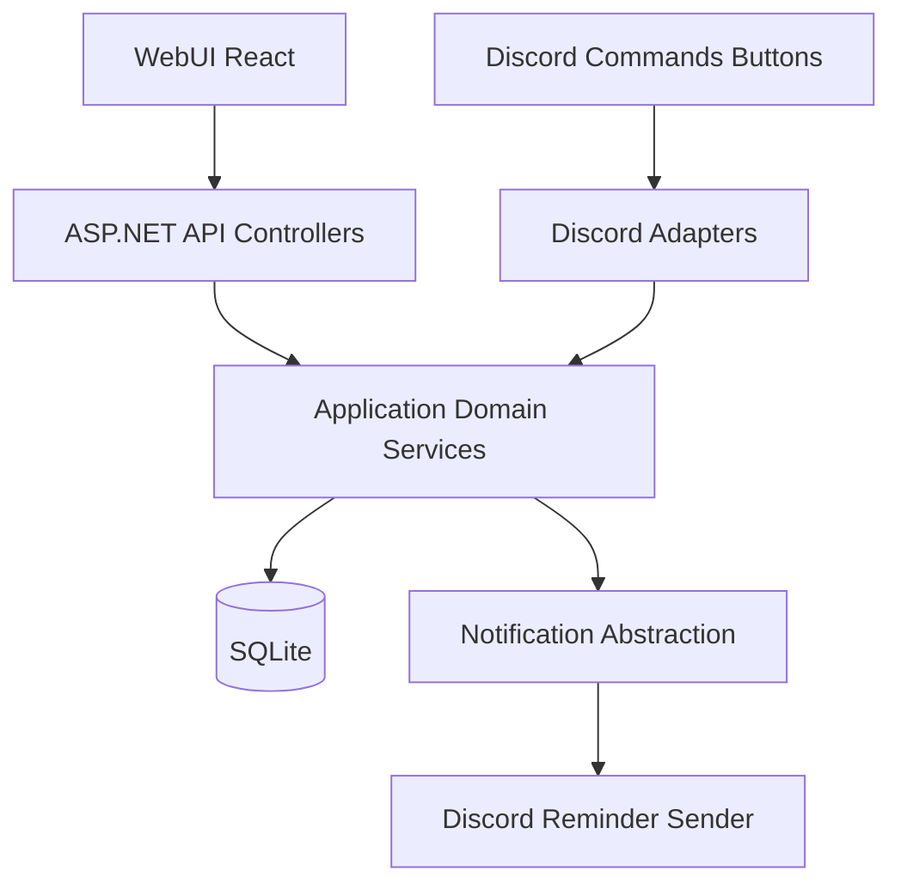

# Refined HomeBot WebUI Adaptation Plan

## Objectives
- Keep existing feature behavior (buy, wishlist, money, calendar, undo) while exposing it to a Web UI.
- Remove Discord presentation concerns from services so command handlers and API controllers both consume the same domain operations.
- Ship a usable single-household web experience first, with explicit upgrade path to user auth later.

## Current Constraints Found In Code
- Service methods currently return Discord UI types (`Embed`, `MessageComponent`) and format mention strings inside service logic.
- Some write logic lives in command modules instead of services (notably buy add/edit/clear), which blocks clean API reuse.
- Entry point is Discord-only (`Program` wires socket client + interactions).
- Persistence schema already supports web use and does not require immediate migration for single-household mode.

## Target Architecture (Single-Household First)

## Security Model (WebUI to API)
- **Frontend trust model:** GitHub Pages frontend is public/static and contains no secrets; all trust decisions happen at API.
- **Transport security:** enforce HTTPS-only access to API; reject plain HTTP except local development.
- **Authentication (single-household v1):** require an app-level bearer token (`Authorization: Bearer ...`) for all `/api/*` except health/meta.
- **Token storage:** keep token in backend environment variables only; never in repository or frontend source.
- **CORS policy:** allow only your GitHub Pages origin(s) and local dev origin; block wildcard origins.
- **Abuse protection:** add per-IP rate limiting and request body size limits on mutation endpoints.
- **API hardening:** validate all inputs server-side, return generic error messages, and avoid leaking stack traces in production.
- **Operational security:** keep SQLite file and service host non-public; expose only API port behind firewall/reverse proxy where possible.
- **Future-ready:** design auth middleware so v1 household token can be swapped for Discord OAuth or local accounts later.

## Phase 1: Split Domain Data From Discord Presentation
- Introduce feature DTOs/view models (e.g., `CalendarItemDto`, `MoneyTransactionDto`, `WishlistItemDto`, `BuyItemDto`, plus paged result wrapper).
- In each service, extract pure query/mutation methods that return DTOs and primitives only (no `Embed`/button construction, no `<@id>` formatting).
- Keep existing `Build*` Discord methods temporarily as adapter wrappers that call DTO methods and then map to embeds/components.
- Move buy write operations from command module into `BuyService` so both Discord and API call same methods.
- Add a lightweight identity display helper for single-household mode (e.g., convert stored IDs to neutral labels like `household`, `member-<id>`) to avoid leaking Discord mention markup to web clients.

## Phase 2: Add Web API Host In The Existing App (Recommended Starting Path)
- Convert startup to ASP.NET minimal hosting while preserving bot startup as hosted background service.
- Register current services in DI once; expose both Discord and HTTP in same process initially.
- Add `/api/health` and `/api/meta` first for deploy verification.
- Configure CORS for GitHub Pages origin and local dev origin.
- Add authentication middleware enforcing the household bearer token for protected routes.
- Enforce HTTPS redirection/HSTS in production path.
- Implement feature endpoints by mapping HTTP requests to new DTO-based service methods:
  - Calendar: list/today/upcoming/get/create/update/delete/complete
  - Money: summary/list/addExpense/addPayment/update/delete
  - Wishlist: list/get/create/update/delete/complete/clearCompleted
  - Buy: list/create/update/delete/complete/clearCompleted
  - Undo: undo last action
- Keep route naming RESTful (`POST /api/money/expenses` etc.) rather than command-style verbs (`/money/add`) for long-term maintainability.

## Phase 3: Validation, Contracts, Error Handling, and Security Middleware
- Move reusable validation rules from command-only context into shared validators usable by API and Discord adapters.
- Standardize API response envelopes and error shapes (400 validation, 404 missing item, 409 conflict if needed).
- Add rate limiting and request size limits for write routes.
- Add structured request logging with sensitive-field redaction.
- Add request/response contract docs (OpenAPI/Swagger).
- Add integration tests for service + API behavior parity with current command semantics.

## Phase 4: Web UI Rollout (React + Vite + Tailwind)
- Build one feature at a time against live API: buy/wishlist first (lowest date/time complexity), then money, then calendar.
- Implement list + detail + create/edit/delete flows with shared pagination/sort/filter primitives.
- Add dashboard endpoint and UI composition only after core feature endpoints stabilize.

## Phase 5: Future-Ready Identity/Auth Path
- Since single-household mode is selected, ship with a simple app-level household token or local-network access guard.
- Keep all actor/user fields in service contracts optional/explicit so later auth can inject real user identity without breaking APIs.
- Reserve future migration path:
  - Discord OAuth keeps current IDs with minimal schema change.
  - Local auth adds `Users` table and mapping strategy from legacy IDs.

## Specific Refinements To Apply To `HomeBot_WebUI_Plan.md`
- Add an explicit “Adapter Layer” between command/controller layer and services.
- Split “Service Refactor” into two concrete tasks:
  - `Domain DTO extraction`
  - `Discord rendering adapters`
- Replace command-like API routes with REST resource routes under `/api`.
- Add “Single-household auth mode (v1)” section and “Auth evolution plan (v2+)” section.
- Add explicit “WebUI/API Security” section (CORS, HTTPS, bearer token, rate limiting, secret management).
- Add a “Parity checklist” per feature to ensure web and Discord behaviors remain aligned.
- Add a first deployment recommendation: single combined process, then optional split into separate API service once stable.

## Recommended File Touch Order (When Implementing)
- `Program.cs`
- `Services/BuyService.cs`
- `Services/WishlistService.cs`
- `Services/MoneyService.cs`
- `Services/CalendarService.cs`
- `Commands/BuyCommands.cs`
- `docs/HomeBot_WebUI_Plan.md`

## Success Criteria
- Discord commands remain functional without behavior regressions.
- API can perform complete CRUD + list flows for all four modules using shared services.
- Web UI can complete the same core workflows without Discord-specific payload assumptions.
- Codebase has clear boundaries: domain logic vs transport adapters (Discord/API).
- API only accepts browser requests from approved origins and protected routes require valid bearer token.
- No secrets are embedded in frontend artifacts or source control.
