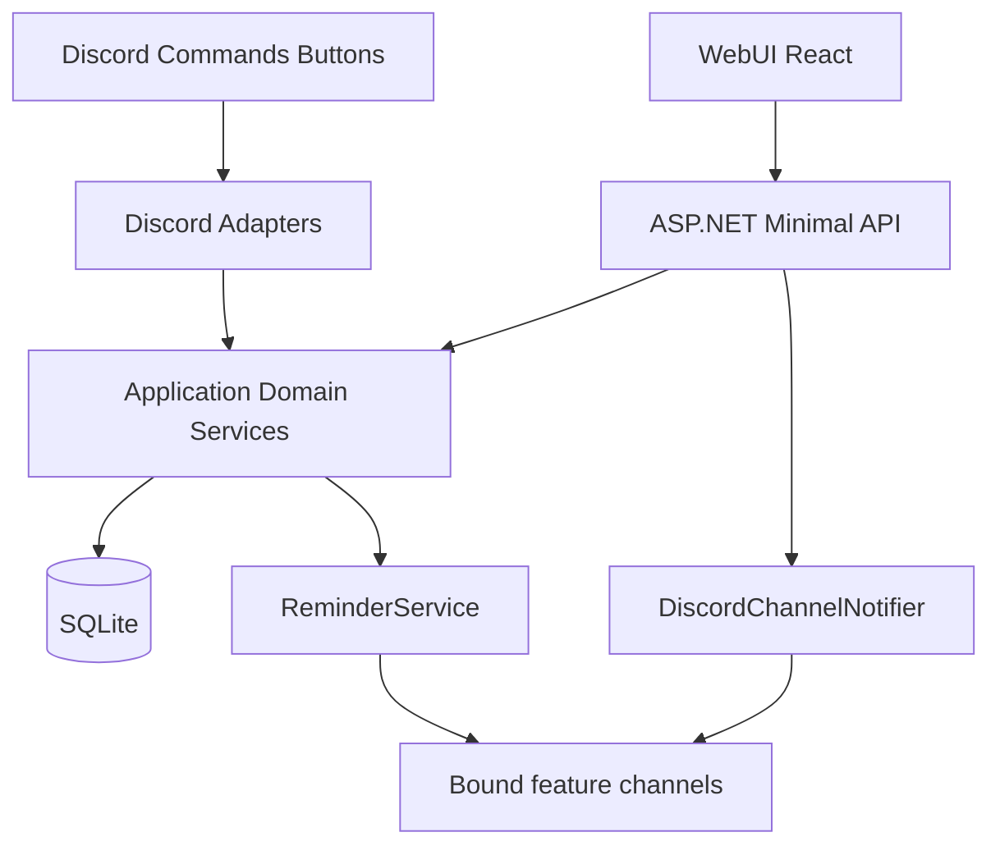

# Refined HomeBot WebUI Adaptation Plan

**Last synced with codebase:** agent session — use this doc to resume work in a new chat. Prefer reading referenced files over assuming behavior.

## Objectives
- Keep existing feature behavior (buy, wishlist, money, calendar, undo) while exposing it to a Web UI.
- Remove Discord presentation concerns from services so command handlers and API both consume the same domain operations.
- Ship a usable single-household web experience first, with explicit upgrade path to user auth later.

## Implementation status (current codebase)

| Area | Status |
|------|--------|
| Domain models / list DTOs (`*ListItemModel`, `PagedResult`, etc.) | In place; services expose non-Discord shapes for lists and mutations. |
| Household-facing labels (`HouseholdIdentity`) | In place for neutral display where needed. |
| Buy writes in `BuyService` | In place (shared by Discord and API). |
| SQLite registration | `AddHomeBotDataServices()` in `Composition/HomeBotDataServices.cs`; optional `DatabaseService(path)` for tests. |
| HTTP API | **Minimal APIs** in `Api/HomeBotApiRegistration.cs`, hosted via `Api/HomeBotApiHost.cs` (not MVC controllers). |
| Process layout | Same process: optional Discord client + optional Kestrel API (`Program.cs`). API-only mode: `HOMEBOT_DISCORD_ENABLED=false` and `HOMEBOT_API_ENABLED=true`. |
| Security (v1) | Bearer `HOMEBOT_API_TOKEN` on `/api/*` except `/api/health`, `/api/meta`, and `/openapi/*`; CORS from `HOMEBOT_ALLOWED_ORIGINS` or default dev origin; HTTPS/HSTS when not Development. |
| REST mutations | Buy, wishlist, money, calendar, undo mapped under `/api/…` with `actorUserId` query **where the route requires it** (not all writes — see below). |
| Phase 3 (limits, OpenAPI, errors, logging) | **Shipped** — see [Phase 3](#phase-3-validation-contracts-error-handling-and-security-middleware) and `Api/HomeBotApiPhase3.cs`. |
| Discord notify on **API creates** | **Shipped** — after successful POST creates (buy, wishlist, money×3, calendar), `IDiscordChannelNotifier` posts to the feature’s bound channel (`buy`, `wishlist`, `money`, `calendar`). Requires Discord enabled, bot connected, and **channel bindings** in DB (`ChannelBindingService`). Uses `DiscordSocketHolder` + startup order fix (see [Discord + API startup](#discord--api-startup-notifications)). |
| Integration tests | `HomeBot.Tests/ApiMutationTests.cs` — core mutations. `HomeBot.Tests/ApiPhase3Tests.cs` — OpenAPI, auth error shape, 413, 429. Both register `DiscordSocketHolder` + `IDiscordChannelNotifier` like production DI. |
| WebUI (`webui/`) | **Vite + React** — `api.ts` wraps all routes; `App.tsx` is a **smoke / mutation console** (tabs, forms, raw JSON). **Not** polished product UI (Phase 4). **Updated:** distinguishes **bearer-only** vs **bearer + actorUserId** actions; expanded wishlist/money/calendar fields; money split route; hints for optional vs required fields. |

**Notable fixes already applied:** SQLite deadlocks avoided by not calling `UndoService.LogAction` while a `DataReader` is still open (e.g. `BuyService.DeleteItem`), and by not calling `DeleteLastAction` inside the same open connection scope as the undo restore SQL in `UndoService.ApplyLastUndo`.

**Operational gotcha (Discord notifications):** If Web/API adds succeed but no Discord message appears, verify **channel bindings** (`setup-set` / `ChannelBindings` table) for keys `buy`, `wishlist`, `money`, `calendar`. Wrong or missing binding = notifier skips or cannot resolve channel.

---

## API surface quick reference (for agents)

### Where `actorUserId` is required (query string)
Typical pattern: `?actorUserId=<discord snowflake>` — must be non-zero. WebUI sends digits; very large snowflakes may exceed JS safe integer (see `webui/src/api.ts` `jsonUlong`).

- Buy: POST add, POST complete, DELETE item  
- Wishlist: POST add, POST complete, DELETE item  
- Money: DELETE transaction  
- Calendar: POST complete, DELETE item  
- Undo: POST `/api/undo`

### Where only bearer token is required (no `actorUserId`)
- Money: POST `/api/money/expenses`, `/api/money/expenses/split`, `/api/money/payments`; PATCH transaction  
- Calendar: POST create, PATCH item  
- Buy: PUT item, DELETE completed  
- Wishlist: DELETE completed  

### Phase 3 artifacts
- **Errors:** `{ "error": string, "code": string }` via `Api/ApiResults.cs` + `Api/ApiErrorBody.cs`  
- **Mutations rate limit:** `MapGroup("/api").RequireRateLimiting("mutation")` in `HomeBotApiRegistration.cs`  
- **Body limit:** Kestrel + `UseApiMaxPayloadContentLengthGuard` in `HomeBotApiPhase3.cs`  
- **OpenAPI:** `GET /openapi/v1.json` (unauthenticated in app; protect at proxy if needed)  
- **Tests:** `AddPhase3Services(maxRequestBodyBytes, mutationPermitsPerMinute)` optional args — tests avoid env races  

---

## Discord + API startup (notifications)

**Problem that was fixed:** `DiscordSocketClient` was registered as `AddSingleton(_ => _client)`. The API could start before `_client` was assigned; the first resolution could cache **null** forever, so `DiscordChannelNotifier` never saw a client.

**Current approach:**
1. `DiscordSocketHolder` singleton (`Services/DiscordSocketHolder.cs`) holds `DiscordSocketClient? Client`.
2. When Discord is enabled, `Program.RunAsync` **constructs** `DiscordSocketClient`, sets `_services.GetRequiredService<DiscordSocketHolder>().Client = _client`, **then** starts `StartApiAsync()` so the API never “wins the race” with an unset client.
3. `DiscordChannelNotifier` reads `holder.Client` (not `GetService<DiscordSocketClient>()`).
4. Login/`StartAsync` still run after `StartApiAsync` is kicked off; until `ConnectionState.Connected`, notify is a no-op.

**Files:** `Program.cs`, `Services/DiscordSocketHolder.cs`, `Services/DiscordChannelNotifier.cs`, `Services/IDiscordChannelNotifier.cs`, `Utils/DiscordNotifyText.cs`, `Composition/HomeBotDataServices.cs`, `Api/HomeBotApiRegistration.cs` (calls after successful creates).

---

## Current constraints (updated from discovery)
- Many flows still have Discord-specific `Build*` helpers on services that compose embeds/components; these sit **beside** DTO/query APIs the HTTP layer uses. Further consolidation is optional cleanup, not a blocker for API + WebUI.
- HTTP surface is **minimal route delegates** with a shared `IServiceProvider` root (same pattern in tests), not a separate controller assembly.
- Slash commands and button handlers remain the other transport; parity is maintained by calling the same services.

## Target architecture (single-household first)

## Security model (WebUI to API)
- **Frontend trust model:** Static/Vite build contains no secrets; all trust decisions happen at API.
- **Transport security:** enforce HTTPS-only access to API in non-Development; local dev may use HTTP.
- **Authentication (single-household v1):** require app-level bearer token (`Authorization: Bearer …`) for all `/api/*` except `/api/health`, `/api/meta`, and `/openapi/*` when `HOMEBOT_API_TOKEN` is configured (empty token yields 503 on protected routes in middleware).
- **Token storage:** `HOMEBOT_API_TOKEN` (and `DISCORD_TOKEN`, etc.) in environment only; never in repo or frontend source.
- **CORS policy:** `HOMEBOT_ALLOWED_ORIGINS` comma-separated list, or default `http://localhost:5173` for Vite.
- **Abuse protection:** per-IP rate limiting on mutation endpoints and configurable max request body — **implemented** (Phase 3 env vars below).
- **API hardening:** validate inputs server-side; production uses exception handler JSON (`internal_error`); stack traces not returned to clients in non-Development.
- **Operational security:** keep SQLite file and host non-public; expose API behind firewall/reverse proxy where possible.
- **Future-ready:** `actorUserId` query parameter preserves a path to real identity once OAuth or local accounts exist.

**Runtime toggles (reference):**
- `HOMEBOT_API_ENABLED=true` — start Kestrel (`HOMEBOT_API_URL`, default `http://0.0.0.0:5050`).
- `HOMEBOT_DISCORD_ENABLED=false` — skip Discord gateway; run API only (after `ConfigureServices()` still builds data services).
- `HOMEBOT_DATABASE_PATH` — SQLite file or `Data Source=…` string for the live app (tests use explicit `DatabaseService(path)` instead to avoid parallel env races).

## Phase 1: Split domain data from Discord presentation
**Largely complete** for API consumption paths.
- Feature models/DTOs and paged results exist for list and detail flows used by services.
- Pure query/mutation methods exist without `Embed`/button construction for the REST layer; Discord adapters still call `Build*` where not yet refactored.
- Buy write operations live in `BuyService` for shared use.
- `HouseholdIdentity` provides neutral labels for web-facing display.

*Remaining optional work:* further trim or relocate remaining `Build*` surface into thin Discord-only adapter types if desired.

## Phase 2: Add web API host in the existing app
**Complete** for the initial REST scope.
- Kestrel runs in the same process; shared `IServiceProvider` from `Program.ConfigureServices()` is passed into `HomeBotApiHost.Configure`.
- `/api/health` and `/api/meta` for deploy verification (`/api/meta` includes `openApi` path and `version` reflects phase work).
- CORS + bearer gate + non-Development HTTPS behavior in `HomeBotApiHost`.
- Feature endpoints map to services (calendar, money, wishlist, buy, undo) with REST-style paths under `/api`.
- WebUI default base URL `http://localhost:5050` (`VITE_API_BASE_URL` override).

## Phase 3: Validation, contracts, error handling, and security middleware
**Shipped for initial exposure** (iterate as needed).
- Centralize validation rules shared by API and Discord where duplication remains — **optional follow-up** (existing `Validation` + `ValidationHelper` already shared).
- Standardize API **error** JSON: `{ "error": string, "code": string }` on 4xx/5xx from API layer; stable `code` values for common cases. Success payloads unchanged (still ad-hoc `ok`, list DTOs).
- Rate limiting: fixed window per IP on **mutation** routes only (`RequireRateLimiting("mutation")` on `/api` write group). Override: `HOMEBOT_API_MUTATION_PERMIT_LIMIT` (default 200/min); tests pass explicit limits via `AddPhase3Services(...)`.
- Request size: `KestrelServerOptions.Limits.MaxRequestBodySize` + early reject when `Content-Length` exceeds cap (`HOMEBOT_API_MAX_BODY_BYTES`, default 64 KiB).
- Structured logging: `UseHttpLogging` with method/path/status/duration only; unhandled errors logged server-side, JSON `internal_error` in non-Development.
- OpenAPI: `Microsoft.AspNetCore.OpenApi` — document at `/openapi/v1.json` (no bearer in app; put reverse-proxy auth on it if needed).
- **Integration tests:** `ApiMutationTests` + `ApiPhase3Tests`.

**Runtime env (Phase 3):**
- `HOMEBOT_API_MAX_BODY_BYTES` — max JSON body (default `65536`).
- `HOMEBOT_API_MUTATION_PERMIT_LIMIT` — POST/PUT/PATCH/DELETE per IP per minute under `/api` mutation group (default `200`).

## Phase 4: Web UI rollout (React + Vite + Tailwind)
**In progress — smoke UI done; product UX not started.**
- `webui/src/api.ts` — list + mutation helpers for all four domains + undo + split expense.
- `webui/src/App.tsx` — tabbed console with token + `actorUserId`, per-domain forms, raw JSON output; **correct** distinction between token-only and actor-required mutations; expanded fields for wishlist, money (including split), calendar; helper text for optional vs required.
- **Next:** replace smoke layout with real list/detail/create/edit flows, shared pagination/filter UX, dashboard composition, design system (Tailwind already in project if configured — confirm `webui` styles).

## Phase 5: Future-ready identity/auth path
Unchanged intent: v1 household bearer + explicit `actorUserId`; later OAuth or local accounts with ID mapping.

## Specific refinements applied vs. original `HomeBot_WebUI_Plan.md` notes
- Adapter layer remains the Discord command/button path vs. minimal HTTP routes.
- Service refactor split: domain models + Discord `Build*` wrappers coexist today.
- REST resource routes under `/api` are in use.
- Single-household auth and evolution plan remain as documented above.
- WebUI/API: CORS + bearer + HTTPS + rate limits + body limits + OpenAPI — implemented as described in Phase 3.
- Parity checklist per feature remains a good manual regression habit (Discord + WebUI against same DB).

## Key files (agent handoff)

| Concern | Files |
|---------|--------|
| HTTP pipeline, CORS, bearer, OpenAPI map | `Api/HomeBotApiHost.cs` |
| Phase 3 services & middleware | `Api/HomeBotApiPhase3.cs` |
| Routes & validation | `Api/HomeBotApiRegistration.cs` |
| Error DTOs | `Api/ApiErrorBody.cs`, `Api/ApiResults.cs` |
| DI registration | `Composition/HomeBotDataServices.cs` |
| Process + Discord/API order | `Program.cs` |
| Web → Discord channel posts | `Services/DiscordChannelNotifier.cs`, `Services/DiscordSocketHolder.cs`, `Services/IDiscordChannelNotifier.cs`, `Utils/DiscordNotifyText.cs` |
| Channel routing | `Services/ChannelBindingService.cs` |
| Web client | `webui/src/api.ts`, `webui/src/App.tsx` |
| Tests | `HomeBot.Tests/ApiMutationTests.cs`, `HomeBot.Tests/ApiPhase3Tests.cs` |

## Success criteria
- Discord commands remain functional without behavior regressions (when Discord enabled).
- API can perform CRUD + list flows for buy, wishlist, money, and calendar, plus undo, using shared services — **verified by integration tests for core HTTP paths.**
- Web UI can drive the same workflows via `api.ts` — **smoke UI in place;** polished workflows tracked under Phase 4.
- Optional: Web/API creates optionally notify Discord feature channels when bindings exist and bot is connected.
- Clear boundaries: domain services vs Discord presentation vs HTTP mapping.
- API accepts browser traffic only from configured origins; protected routes require bearer token.
- No secrets in frontend artifacts or source control.
